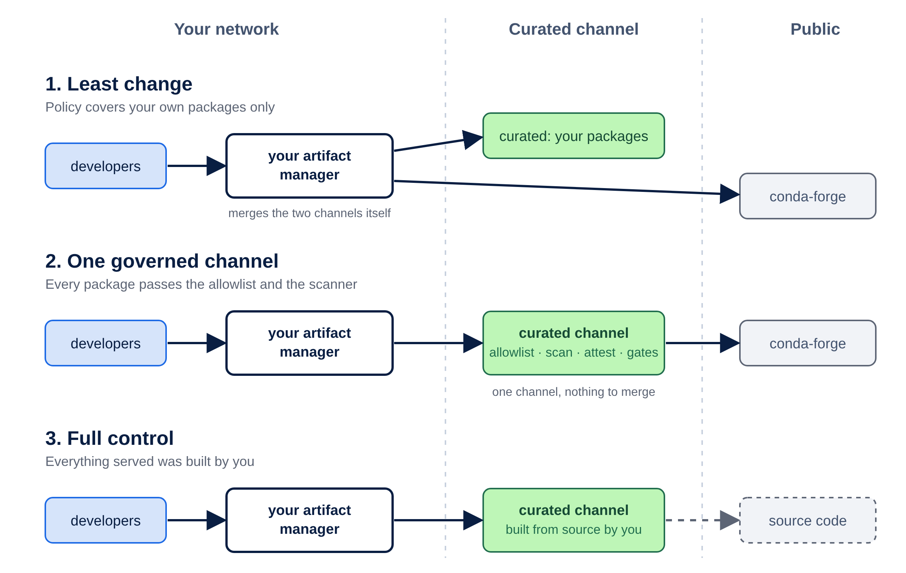

This post is for the person who signs the renewal for the artifact manager, and for the person who has to answer the auditor about what is inside it. If you know either of them, share this with them.

If your organization writes software, you already pay for an artifact manager (Artifactory, Nexus, or something like them: the server that caches every package your developers download and decides who may pull what). It is expensive, it is mandated, and nobody is going to replace it this year. That is fine. This post is about what to put upstream of it, so the thing you already pay for can answer three questions it cannot answer today.

## Three questions your artifact manager cannot answer

We hit these questions while building a private conda channel for a customer in a regulated industry. Conda is the package system most data science and scientific Python teams use, and conda-forge is its public channel, with about 34,000 packages and nearly two billion downloads a month. The questions are not specific to conda. They come up the same way for Python wheels, container images and operating system packages.

**Who built this package, and from what?** Your artifact manager can tell you that someone downloaded version 2.2 of a package on Tuesday. It cannot tell you who compiled it, from which source, with which patches, because the public channel it fetched from does not say so in a form the artifact manager can check. The cache knows what it has. It does not know where it came from.

**Is this the package we approved, or something else with the same name?** Most organizations merge an internal channel with the public one. The merge is done by priority rules, and those rules live in each developer's client configuration, where they are easy to get wrong. An attacker who publishes a public package with the same name as one of yours is betting on exactly that. This is called dependency confusion, and it has worked against companies with much larger security teams than yours.

**What happens when the public source is slow, down, or compromised?** This year the main conda-forge index file passed 400 megabytes, and at least one corporate proxy started refusing it at a size cap, which broke every build behind that proxy. In 2025, conda-forge disclosed that its production upload token had been exposed to every package maintainer for seven weeks. Nothing bad was found, and conda-forge's own advice afterwards was not to rely on it for use cases that need secure provenance. Your artifact manager will faithfully cache whatever the public channel serves.

## Curate upstream, change nothing downstream

The pattern is simple to state. Put a curated channel between the public internet and your artifact manager, and point your artifact manager at it as just another remote.

A curated channel is a registry that does four things the cache does not. It keeps an allowlist, so only approved packages are even visible to the solver; anything else does not exist as far as a developer's tool is concerned, which is a much cleaner failure than a blocked download halfway through an install. It scans what it serves and refuses what fails policy. It holds a signed statement for every package you build yourselves, saying who built it, from what source, on which machine, and the build verifies that statement before anything is linked. And it moves packages through stages with gates, so nothing reaches the channel developers use without passing the checks you decided on.

We built this with [Artifact Keeper](https://github.com/artifact-keeper/artifact-keeper), the open-source universal artifact registry we maintain, and wrote every step up as a [walkthrough](https://artifact-keeper.github.io/walkthroughs/private-conda-channel-pixi/) with the commands and the output. The developers in that walkthrough never change anything. Same tool, same address they always used. The artifact manager never changes either. It gets one new remote URL.

There are four ways to wire it. The first three form a path, and the fourth is the one to keep in mind for the day the renewal comes up.

**Least change.** Your artifact manager keeps pulling conda-forge directly and adds the curated channel for your internal packages only. This is a few hours of work and proves the plumbing. The limit is that policy covers only the internal half, and the merge still happens inside the artifact manager, under rules you may not fully control.

**One governed channel.** The artifact manager's only conda remote is the curated channel, which proxies conda-forge itself. Now every package, public or internal, passes the allowlist and the scanner, and developers see one channel with no priority rules to get wrong. The cost is that the curated channel is now on the critical path, so it has to be run like production. The artifact manager's cache softens this, because anything already pulled keeps working.

**Full control.** The curated channel stops proxying and serves only packages you built or rebuilt yourselves from source. This is the most work by a wide margin, and it is where regulated and air-gapped organizations end up, because it is the only arrangement where the answer to "who built this" is always "we did".

**One registry.** The green box does not have to sit behind anything. Artifact Keeper is itself a universal artifact registry, so it can be the cache, the access control and the curated channel in one place, for conda and for every other format your teams use. Nothing sits in front of it to configure, and there is one audit trail instead of two. This is the arrangement for an organization that does not yet have an artifact manager, or one whose renewal is on the table.

We recommend starting at the first step and moving to the second as soon as the plumbing is proven. The third is a decision to make once you know how many packages you actually depend on, which the allowlist tells you. The fourth is a procurement conversation rather than an engineering one, and the first three mean you never have to win it to get the benefits.

## What it costs and what you get

The cost is one more service to run, or to have run for you, a team that owns the allowlist, and a few days of integration. There is no change to the developer workflow and no change to your artifact manager contract.

What you get is a yes or no answer to "is everything we install approved", a signed statement of who built each internal package that an auditor can check without trusting us, a cache in front of the public channel so what you already use keeps installing when it is slow or down, and an audit trail from the registry rather than from a spreadsheet.

One thing does not go away. Trust moves from the public channel to whoever runs the curated one. If that is your own team, this is the point. If it is a vendor, including us, it belongs in the contract, and the lockfile still pins every package to a hash so the bytes cannot change underneath you.

Everything above is conda because that is where we started. Artifact Keeper serves Python wheels, npm packages and container images from the same registry, and we will write each of those up as we verify it the same way. The engineers on your side will want the [walkthrough](https://artifact-keeper.github.io/walkthroughs/private-conda-channel-pixi/). It starts from an empty host and ends with a channel a security team would sign off on.
